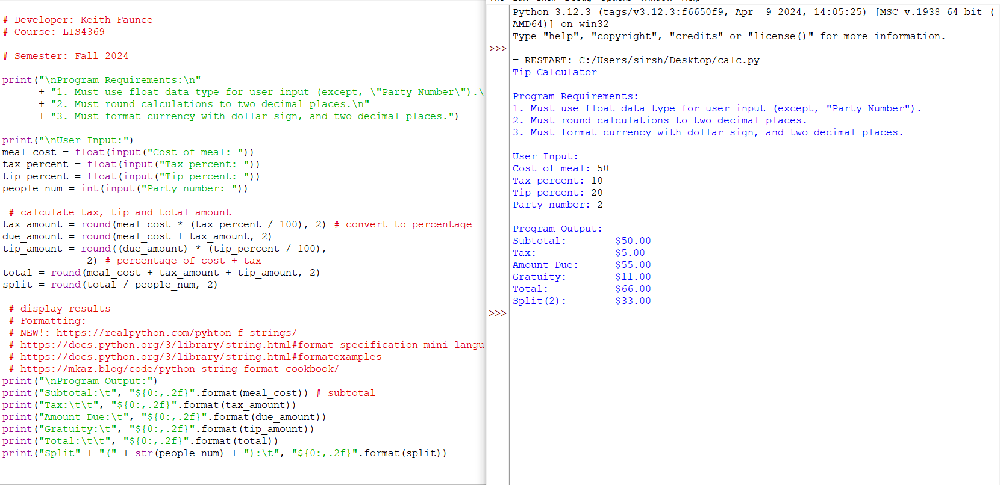
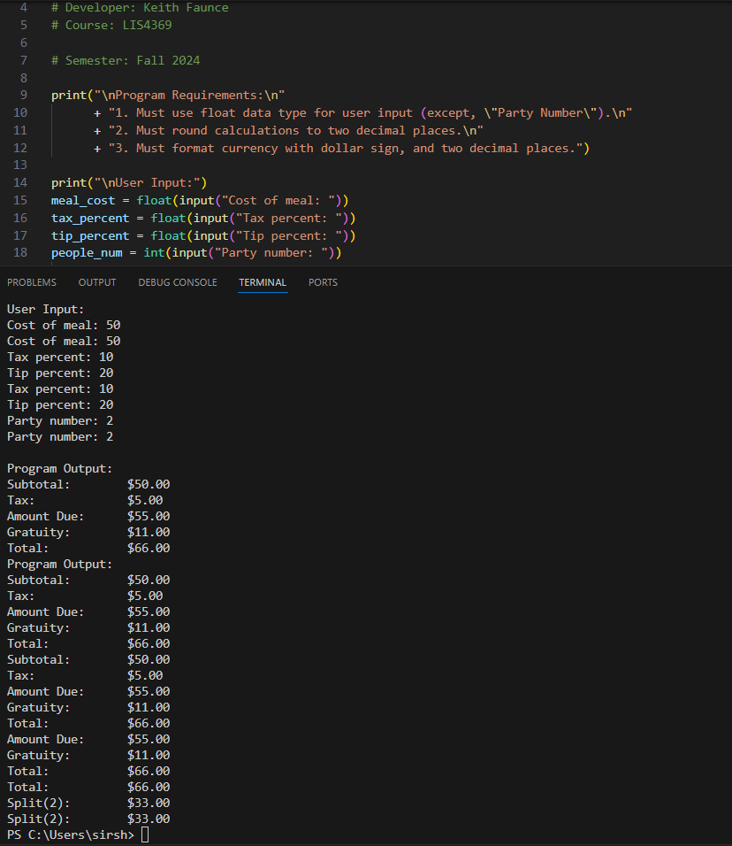
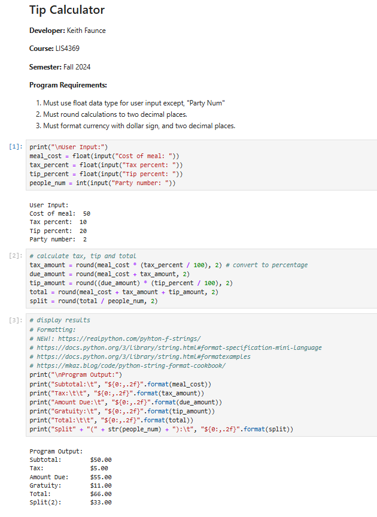

> **NOTE:** This README.md file should be placed at the **root of each of your repos directories.**
>
>Also, this file **must** use Markdown syntax, and provide project documentation as per below--otherwise, points **will** be deducted.
>

# EXTENSIBLE ENTERPRISE SOLUTIONS

## Keith Faunce

### Assignment 1 Requirements:

*Four Parts:*

1. Distributed Version Control with Git and Bitbucket
2. Development Installations
3. Questions
4. Bitbucket repo links:

#### README.md file should include the following items:

* Screenshot of a1_tip_calculator application running
* Link to a1 .ipynb file [tip_calculator.ipynb](tip_calc.ipynb "A1 jupyter notebook")
* git commands w/short descriptions

> This is a blockquote.
> 
> This is the second paragraph in the blockquote.
>
> #### Git commands w/short descriptions:

1. git init - creates an empty git repository
2. git status - shows which files have been staged, which haven't, and which files git is tracking
3. git add - saves current project into commit history
4. git commit - captures the current saved changes
5. git push - push saved changes that git has committed 
6. git pull - brings changes from a different repository to the current
7. git branch - list all branches in your repository and your current branch

#### Assignment Screenshots:

### Screenshot of a1_tip_calculator application running (IDLE):

### Screenshot of a1_tip_calculator application running (Visual Studio Code):

### A1 Jupyter Notebook:

#### Tutorial Links:

*Bitbucket Tutorial - Station Locations:*
[A1 Bitbucket Station Locations Tutorial Link](https://bitbucket.org/username/bitbucketstationlocations/ "Bitbucket Station Locations")

*Tutorial: Request to update a teammate's repository:*
[A1 My Team Quotes Tutorial Link](https://bitbucket.org/lis4930_keithfaunce/bitbucketstationlocations/src/main/ "My Team Quotes Tutorial")
