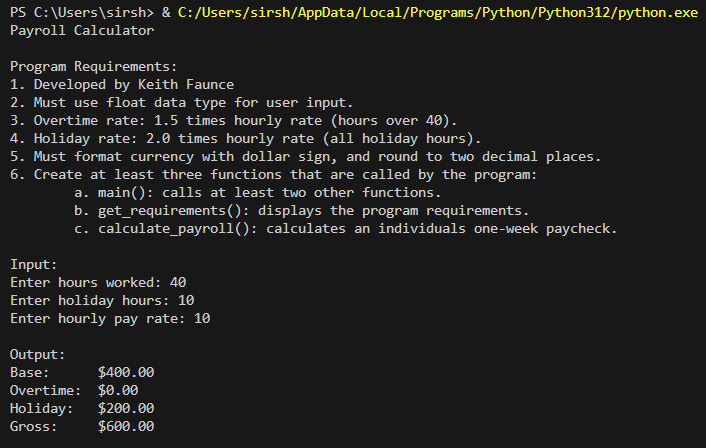
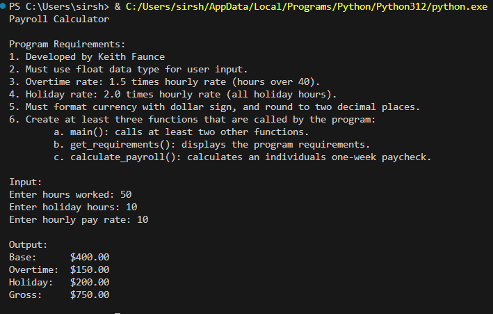
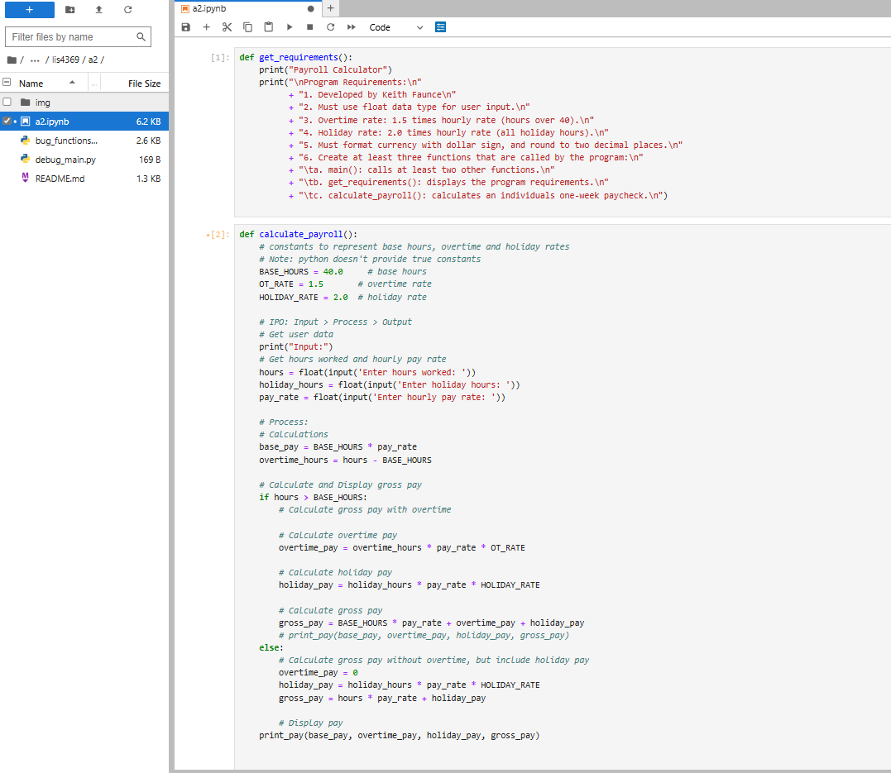
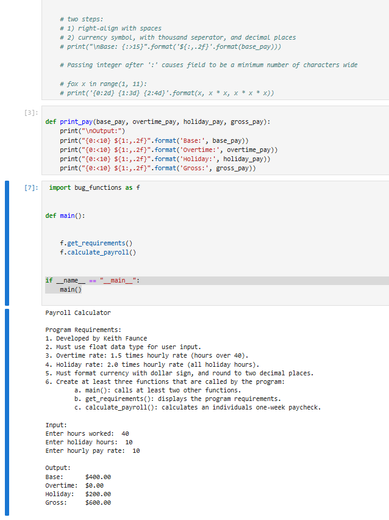
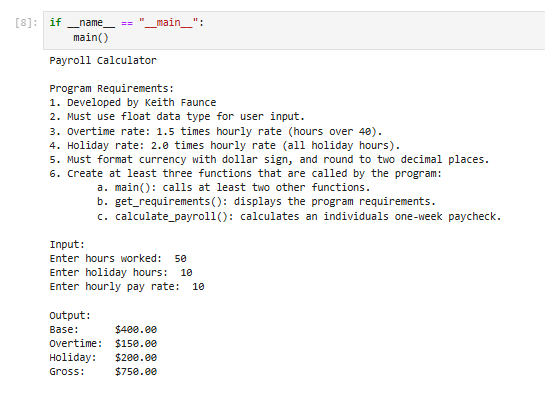
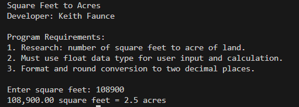
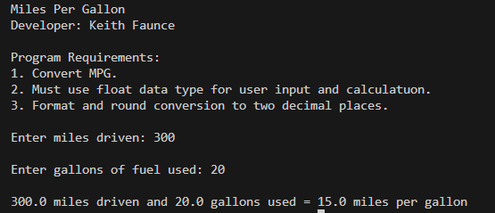
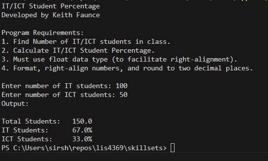

# Extensible Enterprise Solutions

## Keith Faunce

### Assignment 2 Requirements:

1. get_requirements()
2. calculate_payroll()
3. print_pay()
4. Run payroll calculator through jupyter
5. Questions Chs(3, 4)

#### README.md file should include the following items:

* Screenshot(s) of Payroll Calculator running in jupyter lab
* Link to a2 .ipynb file [a2.ipynb](a2.ipynb "A2 jupyter lab")

#### Assignment Screenshots:

### No Overtime

### With Overtime

### Screenshots of A2 running in Jupyter Lab

### Skillsets

Skill Set 1            | Skill Set 2            | Skill Set 3            |
---------------------- | ---------------------- | ---------------------- |
  |   |       |

* Link to skillset_1 functions [SkillSet1Func](../skillsets/s1_functions.py)
* Link to skillset_2 functions [SkillSet2Func](../skillsets/s2_functions.py)
* Link to skillset_3 functions [SkillSet3Func](../skillsets/s3_functions.py)

