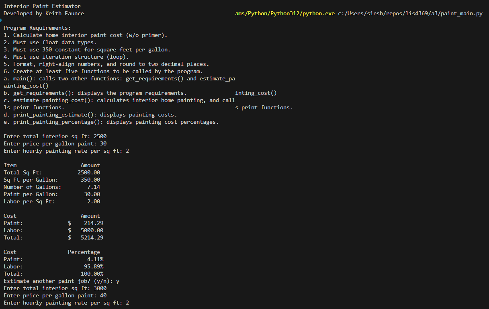
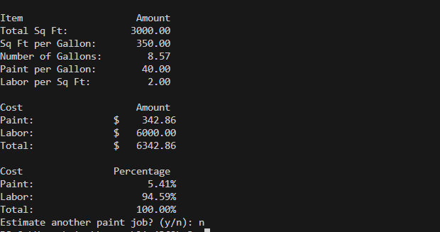
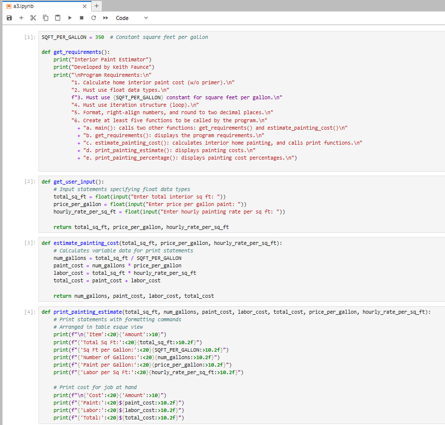
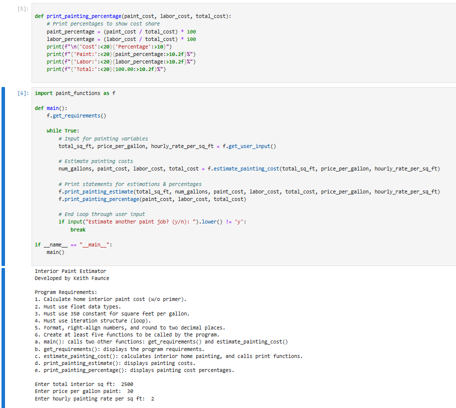
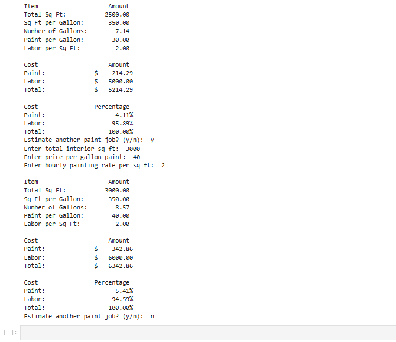
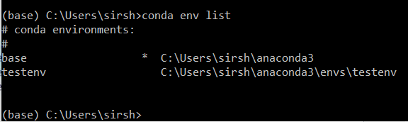
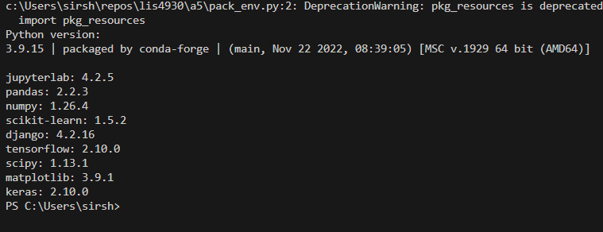
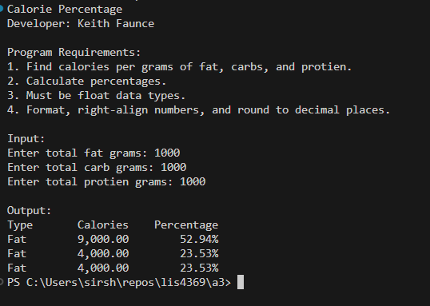
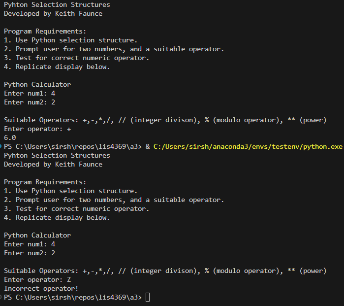

# Extensible Enterprise Solutions

## Keith Faunce

### Assignment 3 Requirements:

1. Create conda environment
2. Import necessary packages
3. get_user_input()
4. estimate_painting_cost()
5. print_painting_estimate()
6. print_painting_percentage()
7. Questions Ch(6)
8. Skillsets 

#### README.md file should include the following items:

* Screenshot(s) of Paint Estimator running in jupyter lab
* Link to a3 .ipynb file [a3](a3.ipynb)
* Link to estimator main [main.py](paint_main.py)
* Link to estimator functions [functions.py](paint_functions.py)

#### Assignment Screenshots:

### Screenshots of A3 running in Jupyter Lab

### Conda environments & packages

[environment HTML](environment.yml)

### Skillsets

Skill Set 4            | Skill Set 5            | Skill Set 6            |
---------------------- | ---------------------- | ---------------------- |
      |       |       |

* Link to skillset_4 functions [s4](s4_functions.py)
* Link to skillset_5 functions [s5](s5_functions.py)
* Link to skillset_6 functions [s6](s6_functions.py)

