# Extensible Enterprise Solutions

## Keith Faunce

### Assignment 4 Requirements:

1. Import python packages for data reading
2. Read URL using pandas
3. Utilize program in Lab & VScode
4. Display data outputs
5. Skillsets
6. Questions (Chs. 9, 10)

#### README.md file should include the following items:

* Screenshot(s) of Data Reader2 running in jupyter lab
* Link to a4 .ipynb file [a4](a4.ipynb)
* Link to reader main [main](DA2_main.py)
* Link to reader functions [functions](DA2_functions.py)

#### Assignment Screenshots

### Screenshots of P1 running in Jupyter Lab

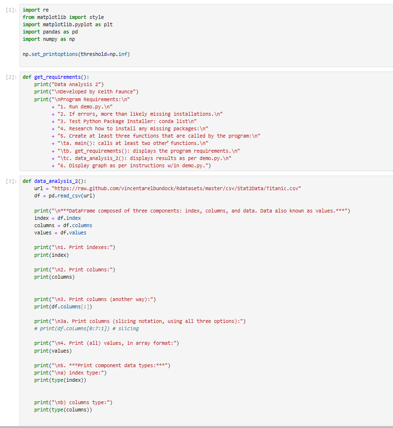

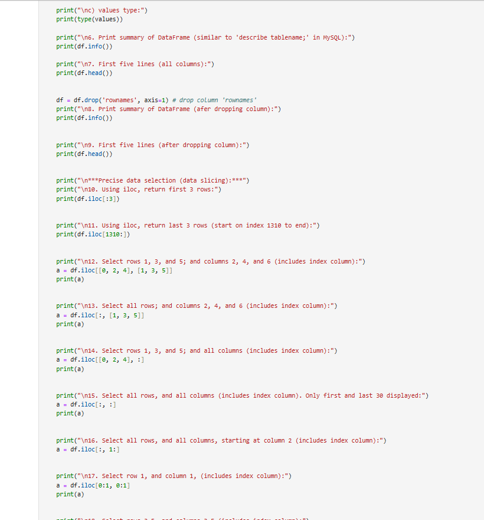

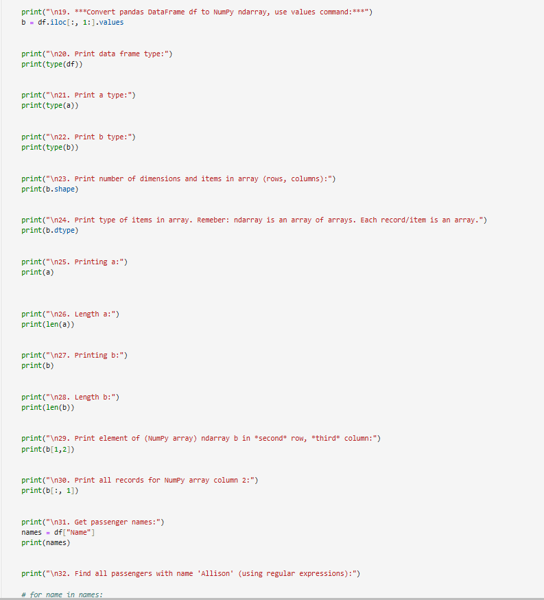

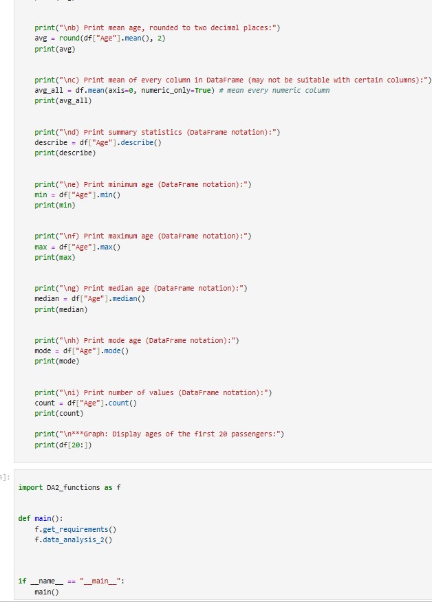

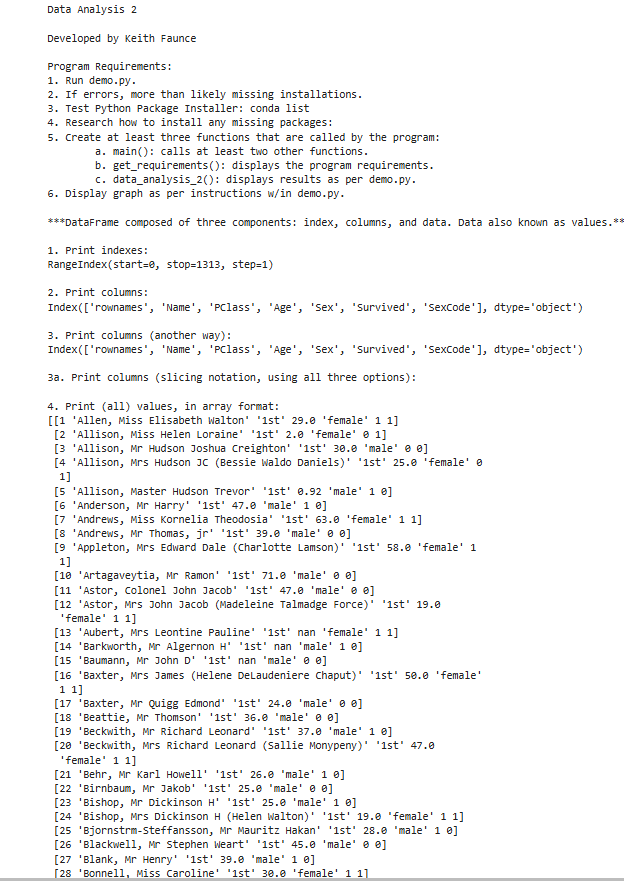

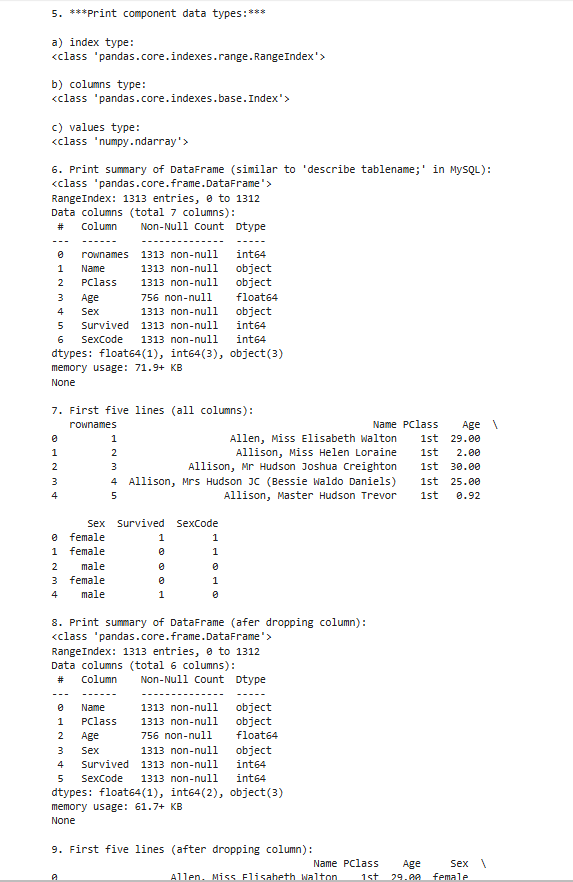

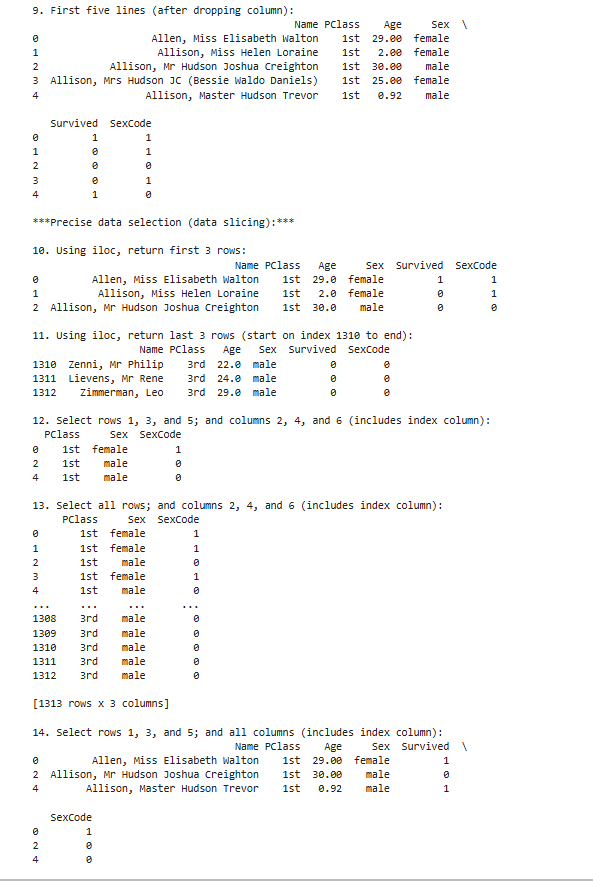

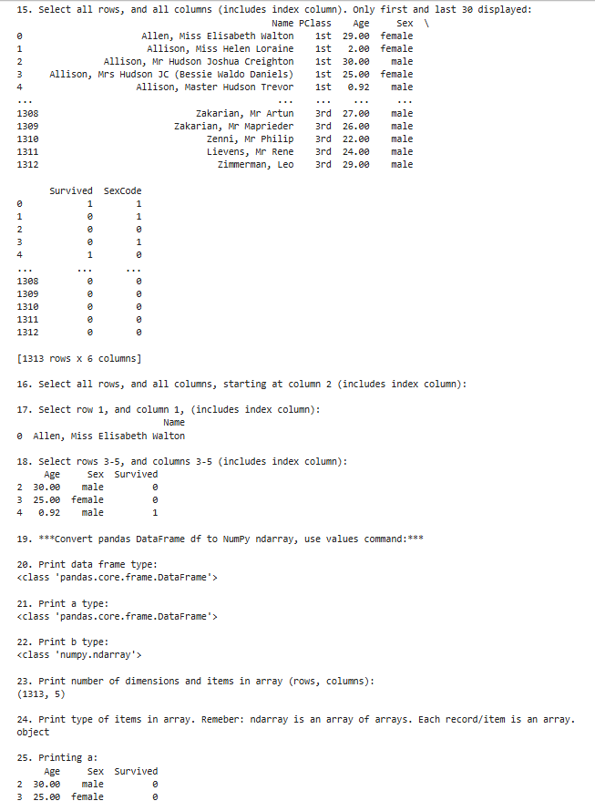

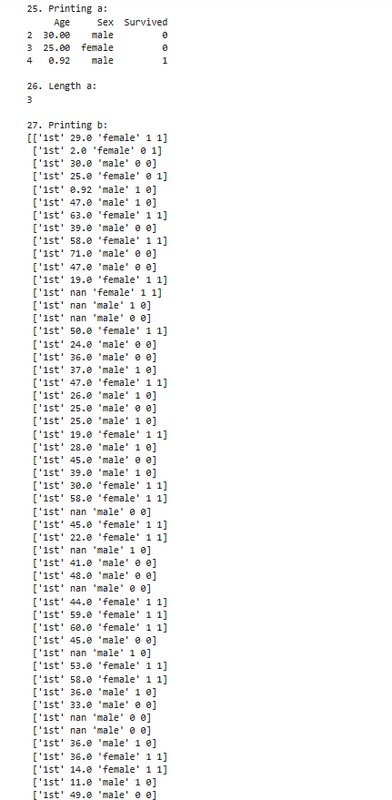

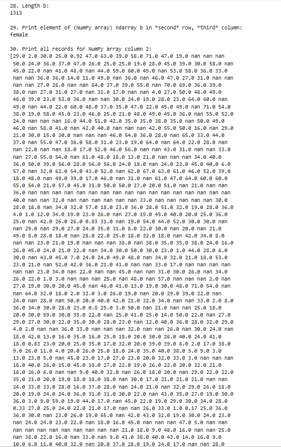

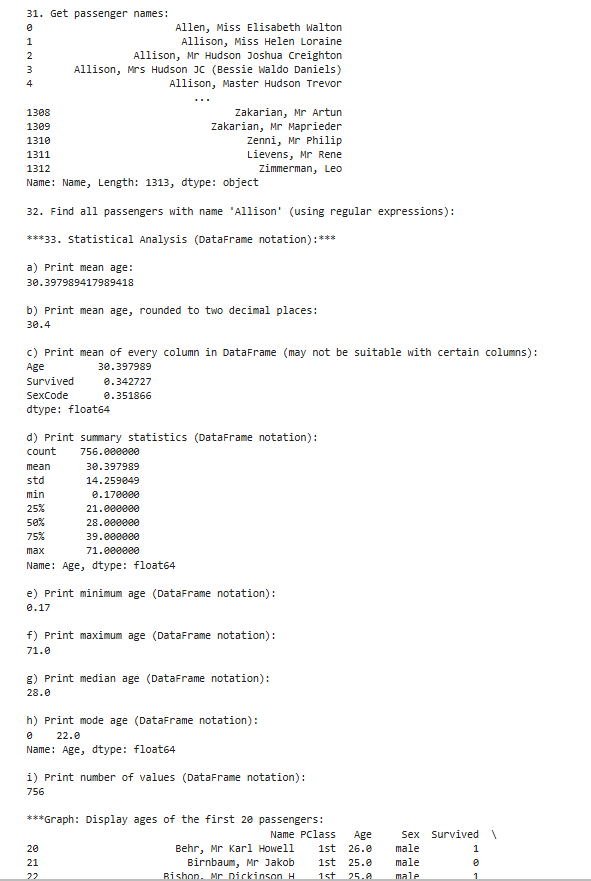

### Skillsets

Skill Set 10           | Skill Set 11           | Skill Set 12           |
---------------------- | ---------------------- | ---------------------- |
 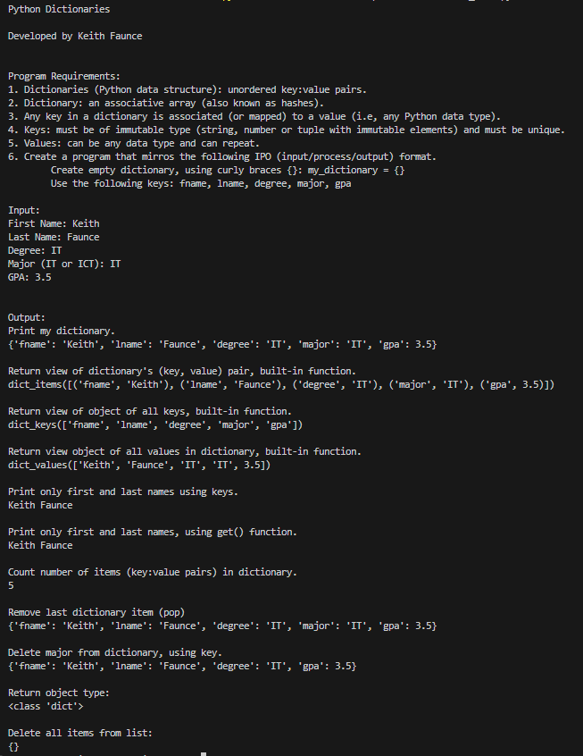        | 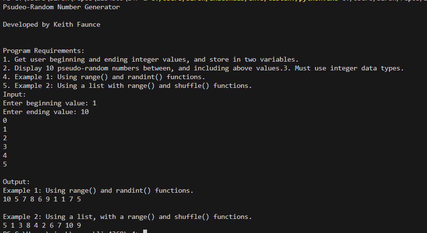         | 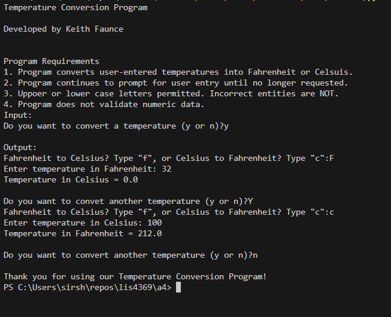         |

* Dictionary functions link: [s10](s10_functions.py)
* Random number generator functions link: [s11](s11_functions.py)
* Temperature conversion functions link: [s12](s12_functions.py)

