# Extensible Enterprise Solutions

## Keith Faunce

### Assignment 5 Requirements:

1. Learn about R
2. Play through the R tutorial
3. Use R to display Titanic age data
4. Generate graphs
5. Skillsets (13-15)
6. Questions (Chs. 11, 12)

#### README.md file should include the following items:

* Screenshots of tutorial & a5 in RStudio
* Link to tutorial statements & code [r_tutorial](r_tutorial/learn_to_use_r.R)
* Link to a5 R file [a5](lis4369_a5.R)
* Skillsets

#### Assignment Screenshots

### Screenshots of R tutorial

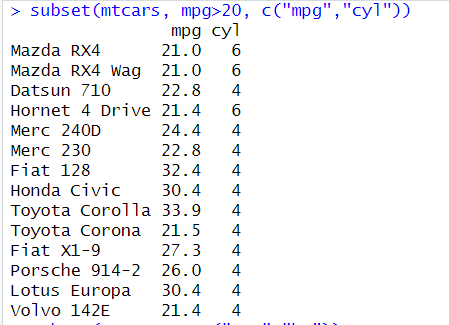

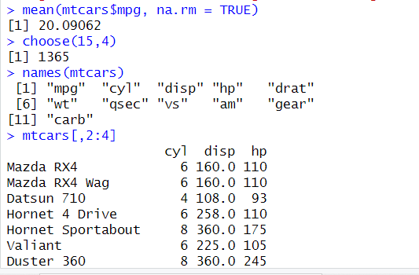

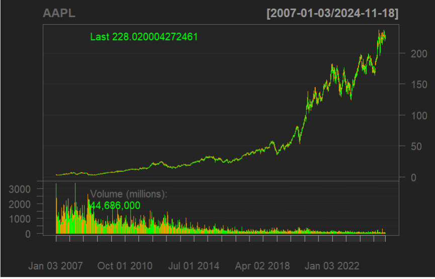

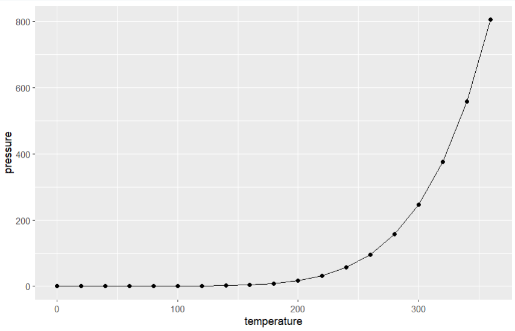

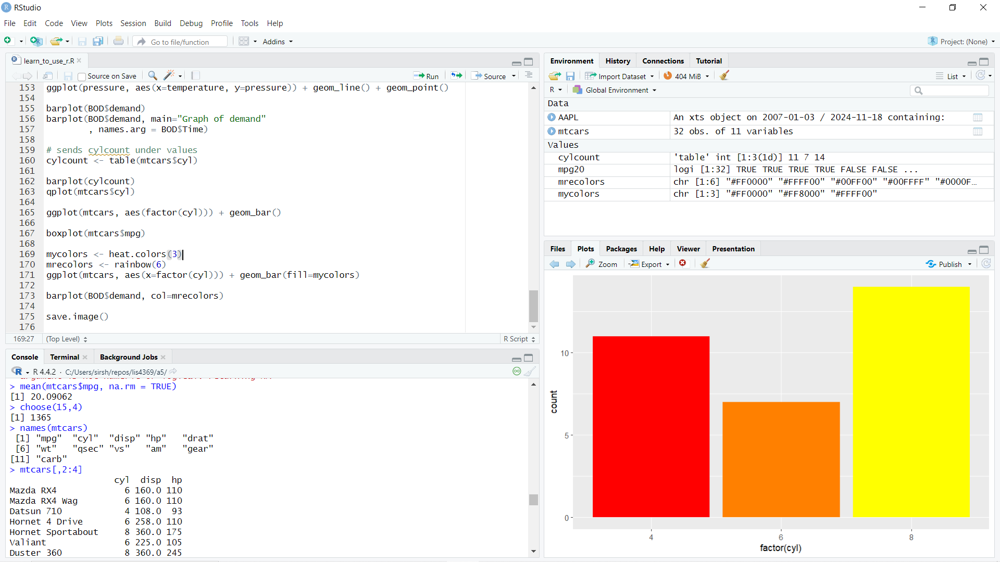

### Screenshots of a5

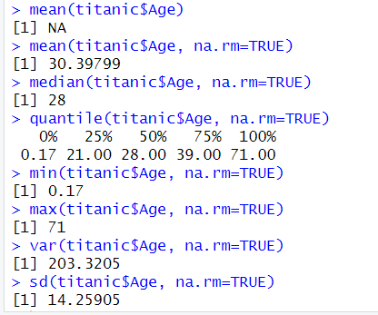

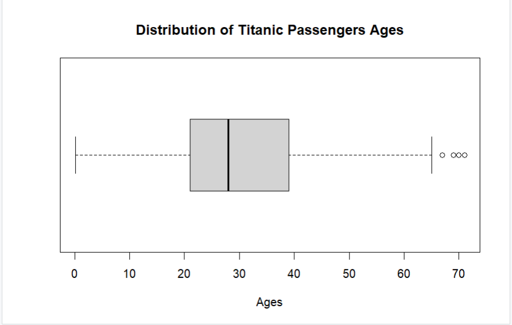

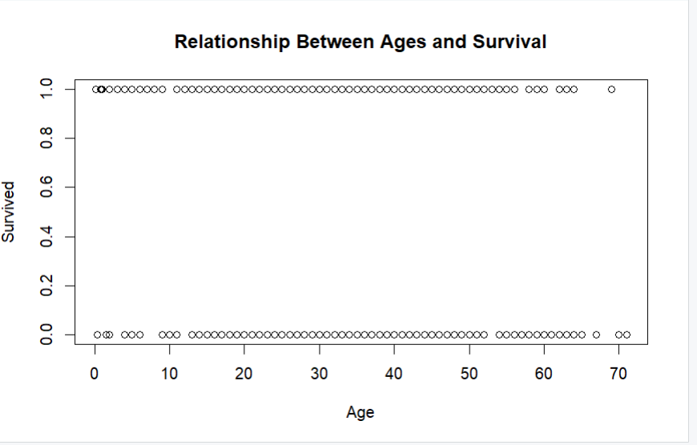

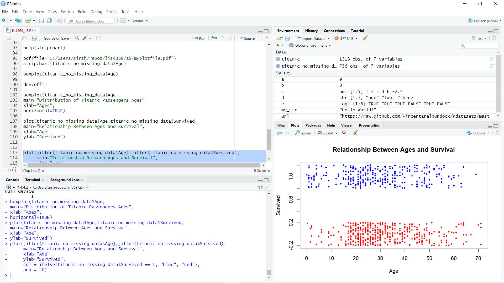

#### Improved Age to Survival Rate

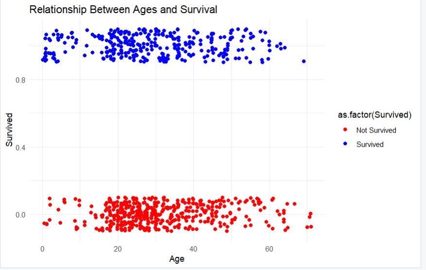

### Skillsets

Skill Set 13           | Skill Set 14           | Skill Set 15           |
---------------------- | ---------------------- | ---------------------- |
 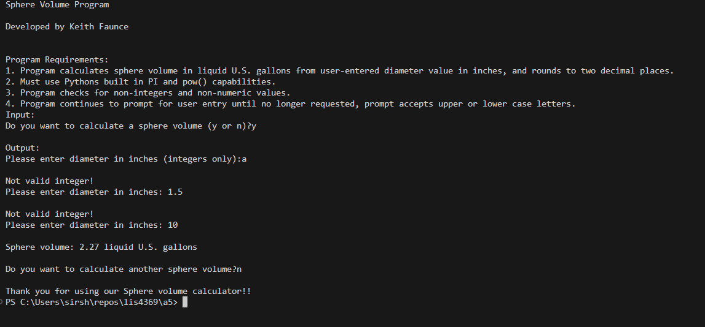       | 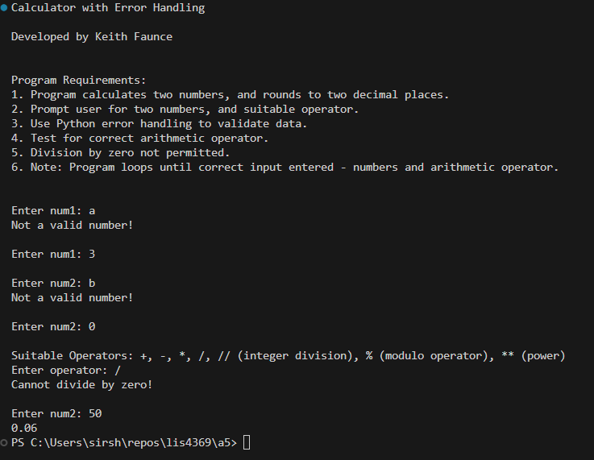        | 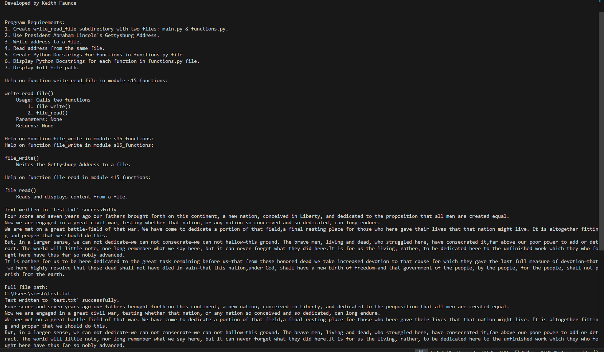       |

