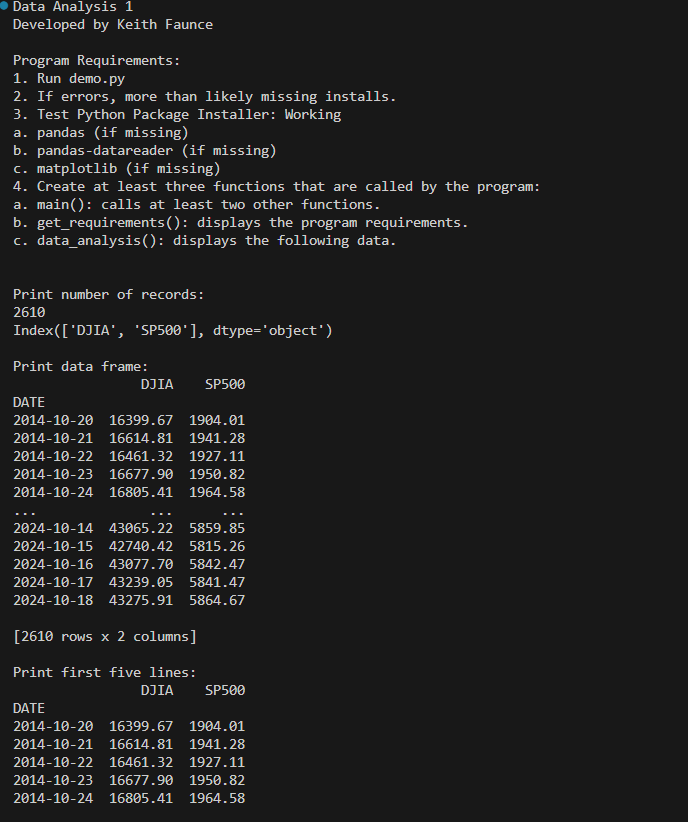
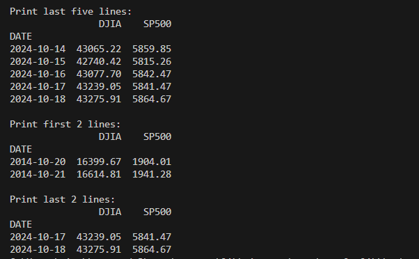
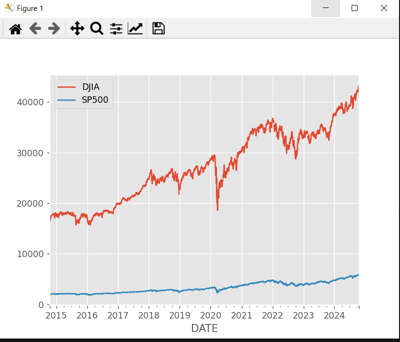
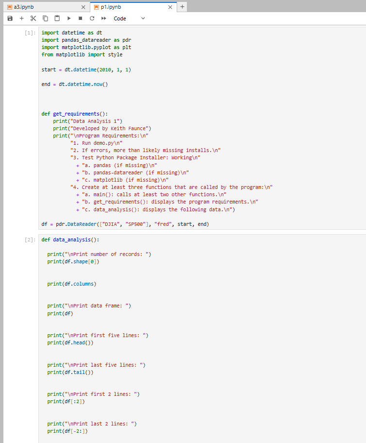
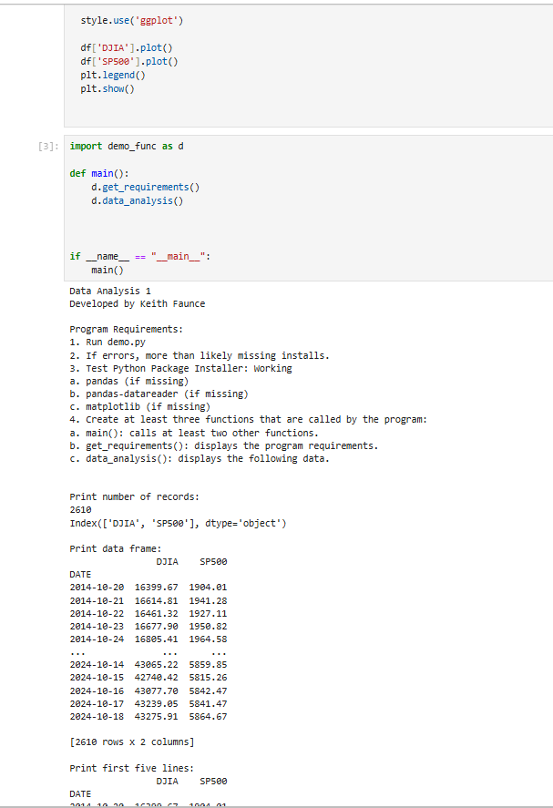
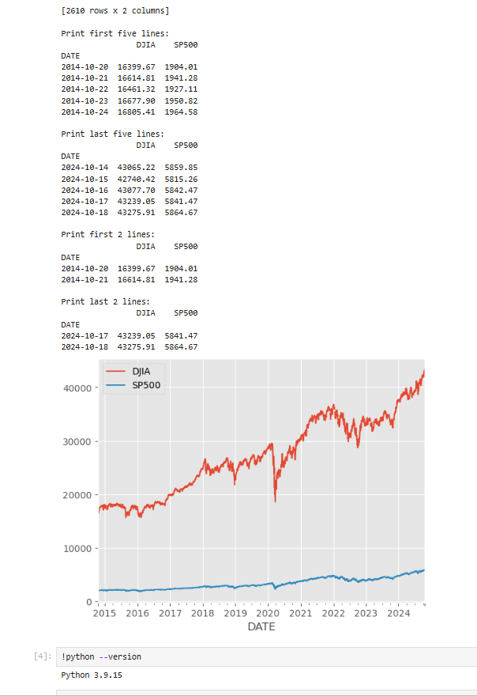
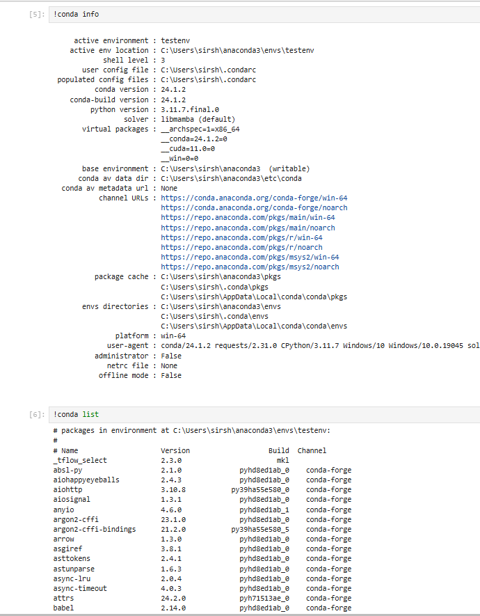
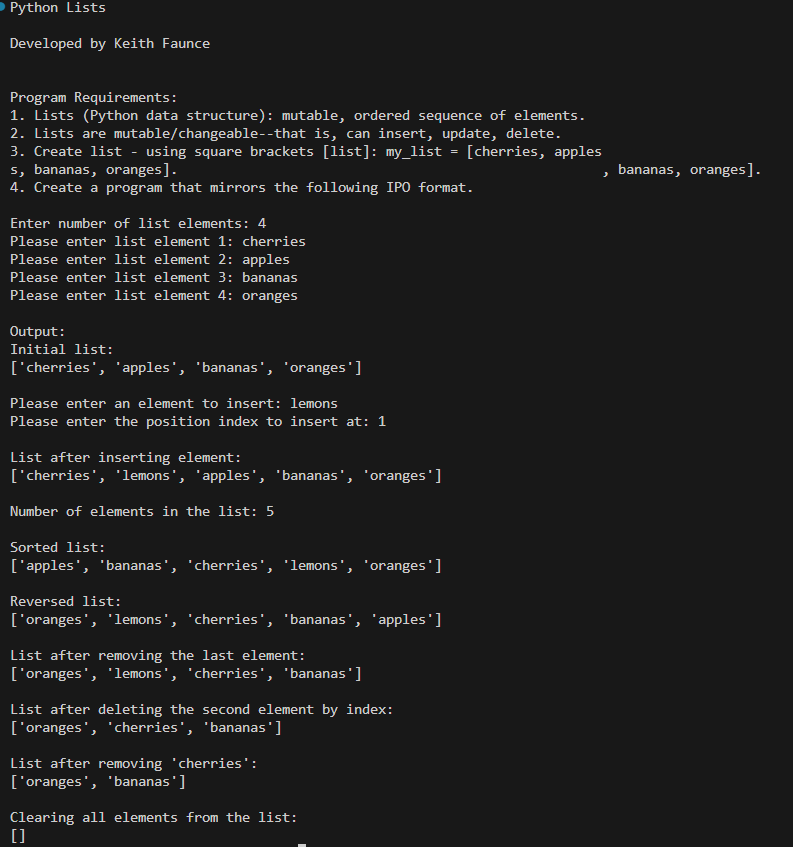
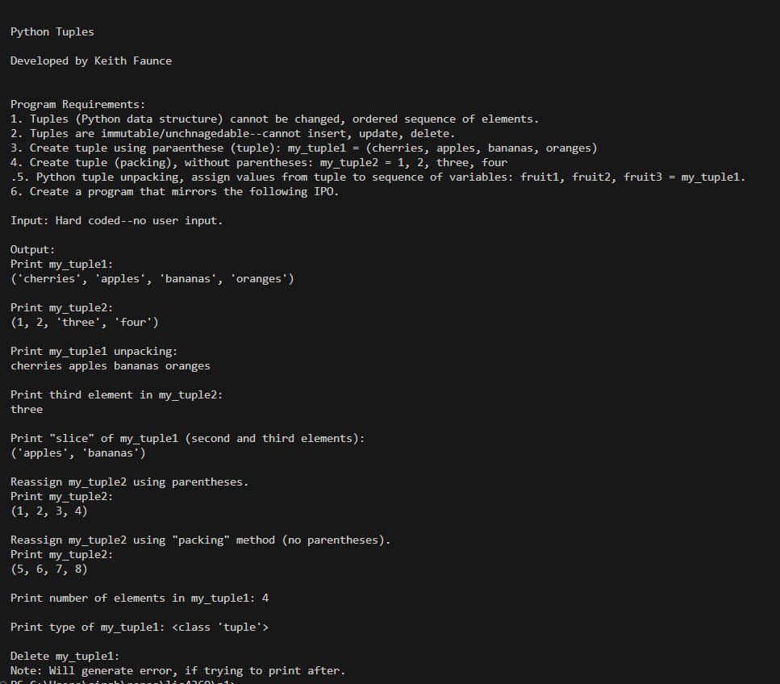
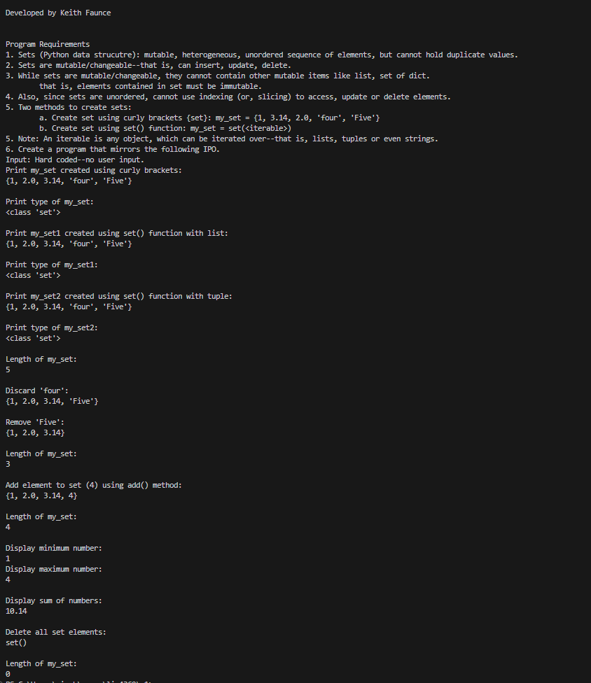

# Extensible Enterprise Solutions

## Keith Faunce

### Project 1 Requirements:

1. Understand pandas-datareader
2. Create display commands in data_analysis func
3. Utilize program in Lab & VScode
4. Lists, Tuples, Sets
5. Questions (Chs. 7, 8)

#### README.md file should include the following items:

* Screenshot(s) of Data Reader running in jupyter lab
* Link to p1 .ipynb file [p1](p1.ipynb)
* Link to reader main [main](dataA_main.py)
* Link to reader functions [functions](demo_func.py)

#### Assignment Screenshots:

### Screenshots of P1 running in Jupyter Lab

### Skillsets

Skill Set 7            | Skill Set 8            | Skill Set 9            |
---------------------- | ---------------------- | ---------------------- |
          |           |           |

