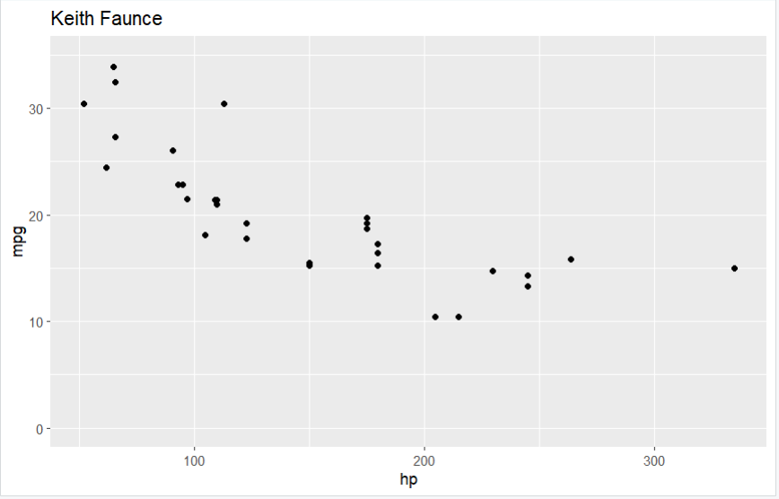
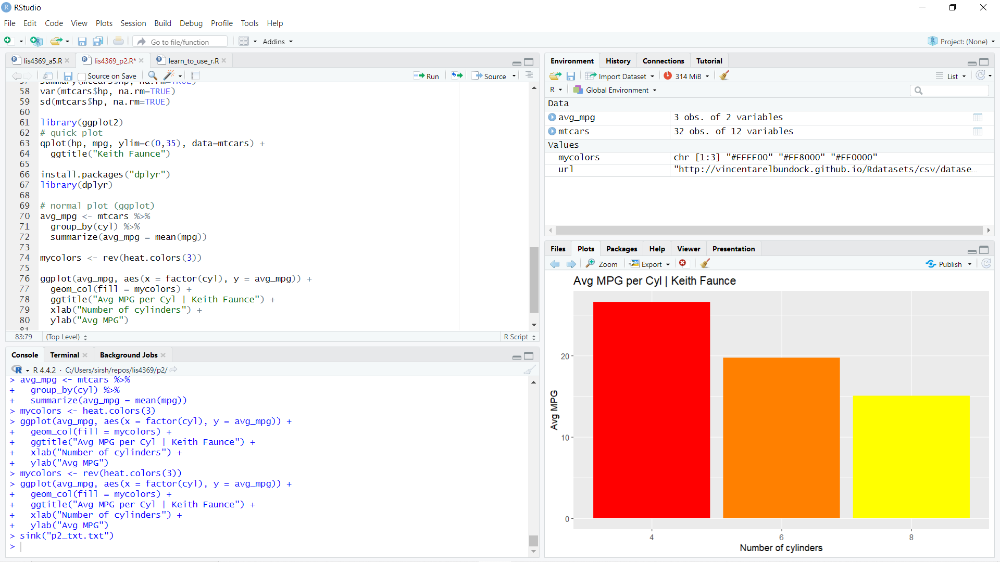
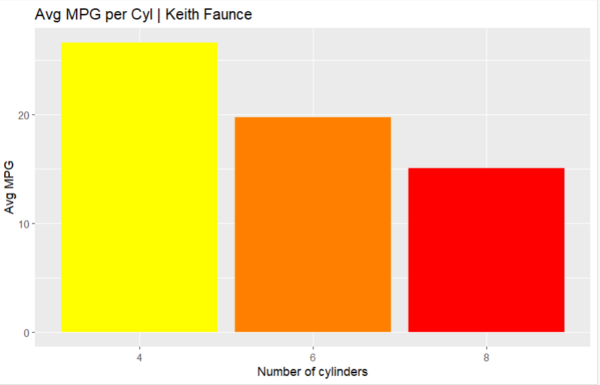

# Extensible Enterprise Solutions

## Keith Faunce

### Project 2 Requirements:

1. Read git .csv file
2. Execute display commands using R
3. Library packages ggplot2 & dplyr
4. Generate graphs
5. Questions (History of R)

#### README.md file should include the following items:

* Screenshots of p2 RStudio
* Link to console output in .txt [p2](p2_txt.txt)
* Link to p2 R file [p2](lis4369_p2.R)

#### Assignment Screenshots

### Screenshots of p2

#### Avg MPG per Cyl

